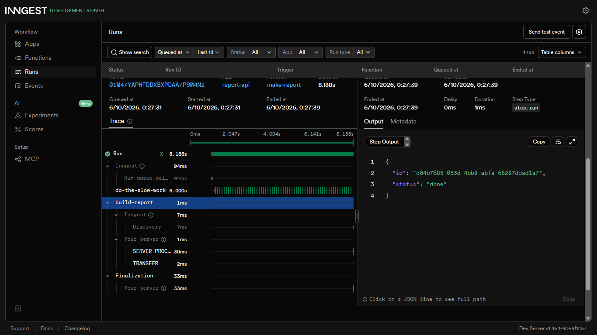
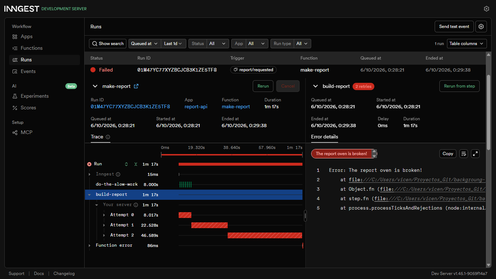
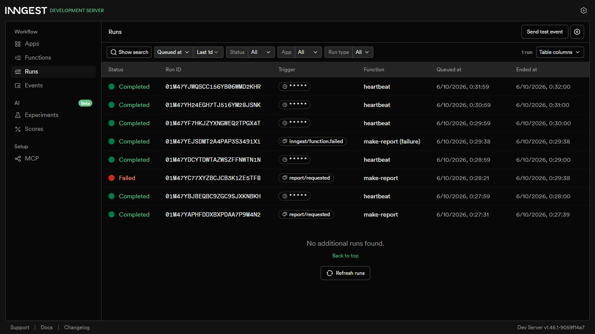

# Background Job


s

A small API where slow work happens in a background job. The endpoint answers
instantly with `202 Accepted`, a status endpoint reports progress, and one cron
job runs on the clock alone. Built with Node.js, Express and
[Inngest](https://www.inngest.com/).

## How it works

1. `POST /reports` saves the report as `pending`, sends a `report/requested`
   event and returns `202` right away.
2. The `make-report` function picks up the event and does the slow work (8 s).
3. `GET /reports/:id` shows the status: `pending`, then `done` (or `failed`).

Reports are stored in memory, so they are lost when the server restarts.

## How to run it

Requirements: Node.js 20.6 or newer.

1. Install dependencies and create your env file:

```
npm install
cp .env.example .env
```

   On Windows PowerShell, use `copy .env.example .env`. The file must contain
   `INNGEST_DEV=1`, which connects the app to the local Inngest Dev Server.

2. In **terminal 1**, start the API (`http://localhost:3000`):

```
npm run dev
```

3. In **terminal 2**, start the Inngest Dev Server (dashboard at
   `http://localhost:8288`):

```
npx inngest-cli@latest dev -u http://localhost:3000/api/inngest
```

Keep both terminals open.

## Endpoints

| Method | Path | Description | Responses |
|--------|------|-------------|-----------|
| GET | `/health` | Check the API status | 200 |
| POST | `/reports` | Request a report. Body: `{ "topic": "cats" }` | 202, 400, 503 |
| GET | `/reports/:id` | Get the status and result of a report | 200, 404 |

## Inngest functions

| Function | Trigger | What it does |
|----------|---------|--------------|
| `say-hello` | event `test/hello` | Sleeps 5 s and returns a greeting (connection test) |
| `make-report` | event `report/requested` | Sleeps 8 s, then builds the report. Retries 2 times; if all fail, marks the report as `failed` |
| `heartbeat` | cron `* * * * *` | Logs how many reports are `pending`, `done` and `failed` |

## Proof

### Happy path

Request (`202` in milliseconds, with timing):

```
'{"topic":"cats"}' | curl.exe -i -w "\nHTTP %{http_code} in %{time_total}s\n" -X POST http://localhost:3000/reports -H "Content-Type: application/json" -d "@-"
```

Response:

```
HTTP/1.1 202 Accepted
X-Powered-By: Express
Content-Type: application/json; charset=utf-8
Content-Length: 64
ETag: W/"40-C8lEHLe6R92zgHAHzUi5loBf3Lo"
Date: Tue, 06 Oct 2026 06:27:31 GMT
Connection: keep-alive
Keep-Alive: timeout=5

{"id":"d04b7685-053d-4bb8-abfa-66287ddad1a7","status":"pending"}
HTTP 202 in 0.021910s
```

Poll right after (`pending`):

```
curl.exe -i http://localhost:3000/reports/d04b7685-053d-4bb8-abfa-66287ddad1a7

HTTP/1.1 200 OK
...
{"id":"d04b7685-053d-4bb8-abfa-66287ddad1a7","topic":"cats","status":"pending"}
```

Poll about 10 seconds later (`done`):

```
HTTP/1.1 200 OK
...
{"id":"d04b7685-053d-4bb8-abfa-66287ddad1a7","topic":"cats","status":"done","result":"Report about cats"}
```

### Failure path

A report with topic `"fail"` is retried 2 times and then marked as `failed`:

```
{"id":"de70a32f-c78d-4beb-90bb-3a14246295fa","topic":"fail","status":"failed"}
```

### Bad input

A request without a `topic` is rejected at the door with `400`, and no job is created:

```
'{}' | curl.exe -i -X POST http://localhost:3000/reports -H "Content-Type: application/json" -d "@-"

HTTP/1.1 400 Bad Request
X-Powered-By: Express
Content-Type: application/json; charset=utf-8
Content-Length: 60
ETag: W/"3c-OFM96p6j1nmKverlWJXalCeotFc"
Date: Tue, 06 Oct 2026 06:43:20 GMT
Connection: keep-alive
Keep-Alive: timeout=5

{"error":"topic is required and must be a non-empty string"}
```

The dashboard shows no new run for this request.

### Dashboard

Completed `make-report` with its two steps (the 8 s sleep and the build step):



Failed `make-report` with its 3 attempts. The sleep ran only once, because
finished steps are saved and not repeated:



All runs together: completed and failed `make-report`, `make-report (failure)`,
and the `heartbeat` runs every minute:



## Stage 3: retries vs. validation

A missing topic is rejected at the door with a `400` because the input is wrong
and would fail the same way on every attempt, so retrying it would only waste
resources and delay the error. A temporary failure, like the broken oven, is
worth retrying because it may succeed on a later attempt.

## Stage 4: cron expressions

- Every day at 08:00: `0 8 * * *`. It means minute 0 of hour 8, on every
  day of the month, every month and every day of the week: once a day at 8 a.m.
- Every Sunday at 22:00: `0 22 * * 0`. It means minute 0 of hour 22 (10 p.m.),
  on any day of the month and any month, but only when the day of the week is
  `0` (Sunday): once a week, on Sundays at 10 p.m.
  
The heartbeat runs every minute only for testing. Servers usually run cron in
UTC, so a real 08:00 job in Mexico City needs the `TZ=America/Mexico_City`
prefix.

## Author

**Vicente Hernández Ramos** — [@vicenhr](https://github.com/vicenhr)